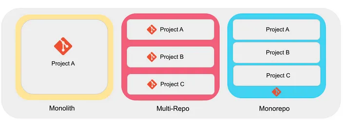

<p align="center">
  <a href="http://nestjs.com/" target="blank"></a>
</p>

## Index <!-- omit in toc -->

- [Source](#source)
- [Mono Repo의 구조](#mono-repo의-구조)
- [Library](#library)
  - [database](#database)
  - [rmq](#rmq)
- [Apps](#apps)
  - [auth](#auth)
  - [billing](#billing)
  - [orders](#orders)
- [Docker](#docker)
  - [Docker](#docker-1)
  - [Docker Compose](#docker-compose)

## Source

- [Build Nest.js Microservices With RabbitMQ, MongoDB & Docker | Tutorial](https://www.youtube.com/watch?v=yuVVKB0EaOQ)
- [NestJS CLI Workspaces](https://docs.nestjs.com/cli/monorepo)
- [NestJS Microservice](https://docs.nestjs.com/microservices/basics#event-based)
- [NestJS Microservice RabbitMQ](https://docs.nestjs.com/microservices/rabbitmq)
- [NestJS Mongo](https://docs.nestjs.com/techniques/mongodb#model-injection)

## Mono Repo의 구조



- 하나의 프로젝트를 작은 단위로 나누고 하나의 repository로 관리
- 장점
  - 종속성과 버전을 통합적으로 관리하여 호환성 및 종속성 관리를 단순화
  - 코드 공유와 재사용이 용이
- 단점 - 저장소의 크기가 커질수록, 체크아웃, 빌드, 검색 등의 작업이 느려질 수 있음 - 세밀한 접근 권한 설정과 보안 관리가 어려워질 수 있음 - 빌드 시스템을 효율적으로 관리하기 위해 복잡한 설정과 최적화가 필요
- 폴더구조

```
├─ apps
│   ├ auth
│   ├ billing
│   └ orders
└─ libs
    ├ database
    └ rabbitmq
```

- 실행

```sh
npm run start:dev
npm run start:dev billing
```

## Library

- 각각의 apps에서는 동일한 모듈 컴포넌트나 다른 컨텍스트를 재사용해야할 경우가 있음
- 이것을 공유할 수 있게 해주는 것이 library
- [Nestjs Libraries](https://docs.nestjs.com/cli/libraries)

### database

- MongoDB에 접속할 수 있는 module
- 재사용이 가능한 \_id 생성을 위한 추상화 클래스를 선언한 schema
- 재상용이 가능하고 공통적으로 사용하는 추상화 클래스의 method가 있는 repository

### rmq

- Dynamic Module을 사용하여 clientpoxy를 설정할 수 있는 module
- RabbitMQ를 사용하여 Microservice를 만들 수 있는 service

## Apps

### auth

### billing

- [rmq](#rmq)에서 만든 서비스를 이용하여 microsercie 생성
  - 하이브리드로 작성됨 [Hybrid application](https://docs.nestjs.com/faq/hybrid-application)
- controller
  - fire-and-forget 패턴의 EventPattern을 사용하여 응답을 보내지 않고 emit 받은 정보 처리
  - RabbitMQ 기본옵션에 noAck 설정하여 emit을 받으면 ack해줄 서비스 필요

### orders

- Rest API의 역할
- Module
  - [NestJS configuration](https://docs.nestjs.com/techniques/configuration)
    - Schema validation로 Joi를 사용
  - MongoDB Connection 설정 및 Schema
  - RabbitMQ Connection 설정
- Service
  - 주문은 orders repository에서 처리하고 billing은 billing moulde에서 처리하게 emit
  - ClientProxy는 Observable stream을 return함으로 rxjx를 사용
- 그외
  - DTO는 데이터가 간단하여 간단한 class-validator 사용
  - [dockerfile](#docker-1)

## Docker

### Docker

- stage를 development와 production으로 분리
- docker compose는 development 스테이지까지 진행

### Docker Compose

- orsers, billing, rabbitmq, mongodb (replica 2)
- app service
  - Dockerfile이 root 폴더를 기준으로 실행됨으로 context: .
  - target을 develoment로 apps에 맞는 command 필요
  - 그외 경로에 맞게 내용을 수정했으며 microservice만 있는 app은 포트삭제
- rabbitmq
  - [DockerHub rabbitmq](https://hub.docker.com/_/rabbitmq)
- mongodb
  - [DockerHub bitnami/mongodb](https://hub.docker.com/r/bitnami/mongodb)
  - Postgres만 써봐서.. 무지 헷갈렸음..
